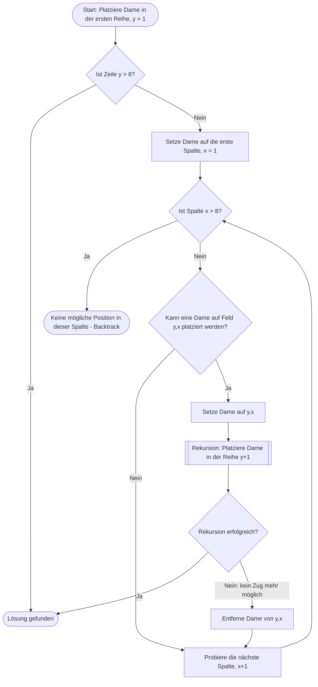

## Das "Acht-Damen-Problem"

Das 8-Damen-Problem war unser Einstieg in das Thema **Rekursion**.\
Aufgabe ist es, genau acht Damen auf einem handelsüblichen Schachbrett (8x8 Felder) zu platzieren, ohne dass diese sich gegenseitig schlagen.
Dabei müssen die möglichen Spielzüge der Schachfigur eingehalten werden:
1. Es darf keine weitere Dame in derselben Reihe stehen (horizontal)
2. Es darf keine weitere Dame in derselben Spalte stehen (vertikal)
3. Es darf keine weitere Dame diagonal stehen\

Insgesamt gibt es für dieses Problem genau 92 mögliche Lösungen.

Der Lösungsansatz besteht aus dem sogenannten **"Backtracking"**. Bei diesem Verfahren geht man, sofern kein nächster Zug möglich ist, einen Schritt wieder zurück und probiert die nächstmöglichen Platzierungen.

Um den Algorithmus zu veranschaulichen, kann man das ganze als Programmablaufplan (PAP) darstellen:

### Spielablauf visuell

Schachbrett 8x8\
⬜️⬜️⬜️⬜️⬜️⬜️⬜️⬜️8\
⬜️⬜️⬜️⬜️⬜️⬜️⬜️⬜️7\
⬜️⬜️⬜️⬜️⬜️⬜️⬜️⬜️6\
⬜️⬜️⬜️⬜️⬜️⬜️⬜️⬜️5\
⬜️⬜️⬜️⬜️⬜️⬜️⬜️⬜️4\
⬜️⬜️⬜️⬜️⬜️⬜️⬜️⬜️3\
⬜️⬜️⬜️⬜️⬜️⬜️⬜️⬜️2\
⬜️⬜️⬜️⬜️⬜️⬜️⬜️⬜️1\
A -B -C -D -E -F -G -H

Mögliche Züge/Platzierung einer Dame\
🟥️⬜️⬜️⬜️⬜️⬜️⬜️🟥️8\
🟥️⬜️⬜️⬜️⬜️⬜️🟥️⬜️7\
🟥️⬜️⬜️⬜️⬜️🟥️⬜️⬜️6\
🟥️⬜️⬜️⬜️🟥️⬜️⬜️⬜️5\
🟥️⬜️⬜️🟥️⬜️⬜️⬜️⬜️4\
🟥️⬜️🟥️⬜️⬜️⬜️⬜️⬜️3\
🟥️🟥️🟩️⬜️⬜️⬜️⬜️⬜️2\
💁🏼‍♀️️🟥️🟥️🟥️🟥️🟥️🟥️🟥️1\
A -B -C -D -E -F -G -H

Start unten Links; Platzierung bis kein Zug mehr möglich\
⬜️⬜️⬜️⬜️⬜️⬜️⬜️🟥️8\
⬜️⬜️⬜️⬜️⬜️💁🏼‍♀️️⬜️⬜️7\
⬜️⬜️⬜️💁🏼‍♀️️⬜️⬜️⬜️⬜️6\
⬜️💁🏼‍♀️️⬜️⬜️⬜️⬜️⬜️⬜️5\
⬜️⬜️⬜️⬜️⬜️⬜️💁🏼‍♀️️⬜️4\
⬜️⬜️⬜️⬜️💁🏼‍♀️️⬜️⬜️⬜️3\
⬜️⬜️💁🏼‍♀️️⬜️⬜️⬜️⬜️⬜️2\
💁🏼‍♀️️⬜️⬜️⬜️⬜️⬜️⬜️⬜️1\
A -B -C -D -E -F -G -H

Backtracking; Einen Schritt zurück, weitere Platzierungen ausprobieren.
Kein Zug möglich? Einen weiteren Schritt zurück.\
⬜️⬜️⬜️⬜️⬜️🟥️⬜️⬜️8\
⬜️⬜️⬜️⬜️⬜️🔳️⬜️💁🏼‍♀️️7\
⬜️⬜️⬜️💁🏼‍♀️️⬜️⬜️⬜️⬜️6\
⬜️💁🏼‍♀️️⬜️⬜️⬜️⬜️⬜️⬜️5\
⬜️⬜️⬜️⬜️⬜️⬜️💁🏼‍♀️️⬜️4\
⬜️⬜️⬜️⬜️💁🏼‍♀️️⬜️⬜️⬜️3\
⬜️⬜️💁🏼‍♀️️⬜️⬜️⬜️⬜️⬜️2\
💁🏼‍♀️️⬜️⬜️⬜️⬜️⬜️⬜️⬜️1\
A -B -C -D -E -F -G -H

