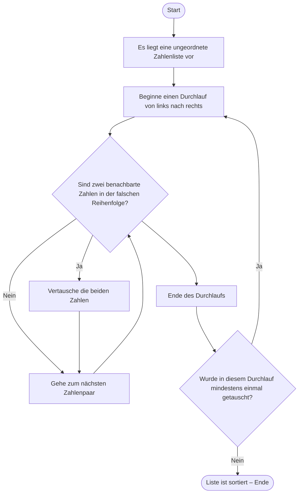

```mermaid
flowchart TD
    Start([Start])
    Eingabe[Es liegt eine ungeordnete Zahlenliste vor]
    BeginnDurchlauf[Beginne einen Durchlauf von links nach rechts]
    Vergleich{Sind zwei benachbarte Zahlen in der falschen Reihenfolge?}
    Tausch[Vertausche die beiden Zahlen]
    Weiter[Gehe zum nächsten Zahlenpaar]
    EndeDurchlauf[Ende des Durchlaufs]
    NochTausch{Wurde in diesem Durchlauf mindestens einmal getauscht?}
    Fertig([Liste ist sortiert – Ende])

    Start --> Eingabe
    Eingabe --> BeginnDurchlauf
    BeginnDurchlauf --> Vergleich
    Vergleich -- Ja --> Tausch
    Vergleich -- Nein --> Weiter
    Tausch --> Weiter
    Weiter --> Vergleich
    Vergleich --> EndeDurchlauf
    EndeDurchlauf --> NochTausch
    NochTausch -- Ja --> BeginnDurchlauf
    NochTausch -- Nein --> Fertig
```