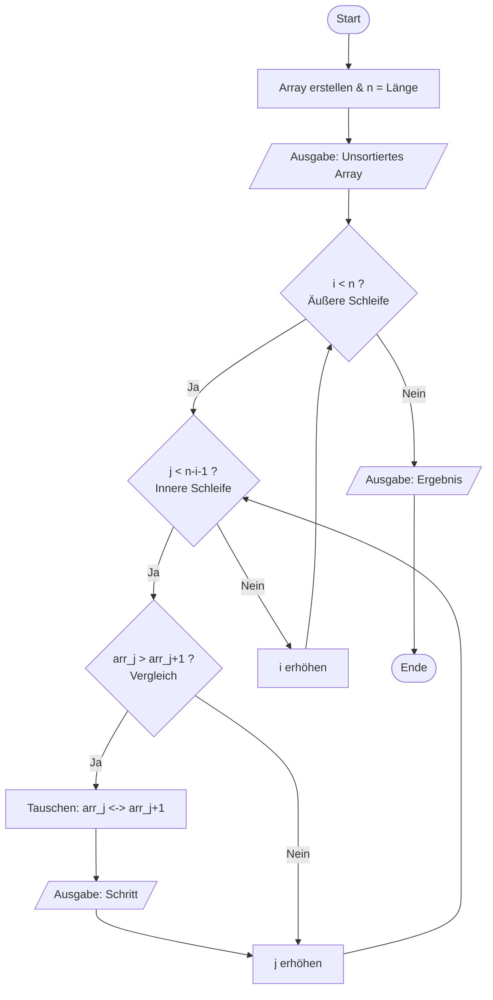

## Bubble-Sort
Bubble-Sort ist ein sehr einfacher Sortieralgorithmus. Er ordnet eine Liste, indem er benachbarte Elemente immer wieder vergleicht und vertauscht, wenn sie in der falschen Reihenfolge stehen.
Der Name kommt daher, dass große Werte wie Luftblasen nach oben „aufsteigen“.

### Grundidee
1. Gehe die Liste von links nach rechts durch.
2. Vergleiche jeweils zwei Nachbarn.
3. Sind sie falsch sortiert → tausche sie.
4. Wiederhole das Ganze mehrmals, bis keine Vertauschung mehr nötig ist. Und dies passiert in zwei Schleifen.

### PAP des Bubble-Sorts
