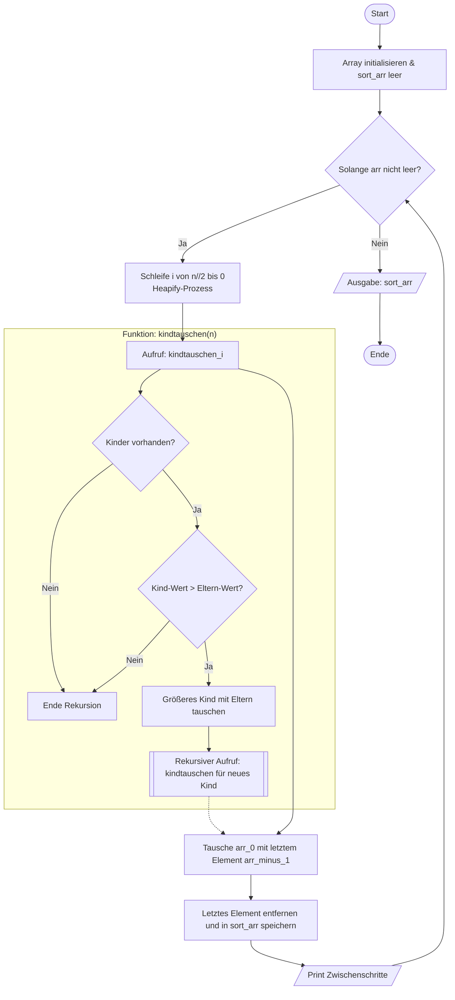

## Heap-Sort
Heap-Sort ist ein vergleichsbasiertes Sortierverfahren, das auf einer speziellen Datenstruktur basiert: dem Heap (genauer: Max-Heap). Ein Max-Heap ist ein binärer Baum, bei dem der größte Wert immer an der Wurzel steht und jedes Eltern-Element größer oder gleich seinen Kindern ist.

### Grundidee
Heap-Sort ist ein Sortieralgorithmus, der einen Heap (meist einen Max-Heap) nutzt:
1. Heap aufbauen: Das Array wird so umgeordnet, dass das größte Element immer oben (an Position 0) steht und wie ein Baum aussieht.
2. Sortieren: Das größte Element wird mit dem letzten Element getauscht und ganz ans Ende gebracht und „entfernt“. Also in ein anderes Sortiertes Array gegeben.
3. Heap wiederherstellen: Der Heap wird neu angepasst (heapify).
4. Das wiederholt sich, bis alle Elemente sortiert sind.

### PAP des Heap-Sorts
