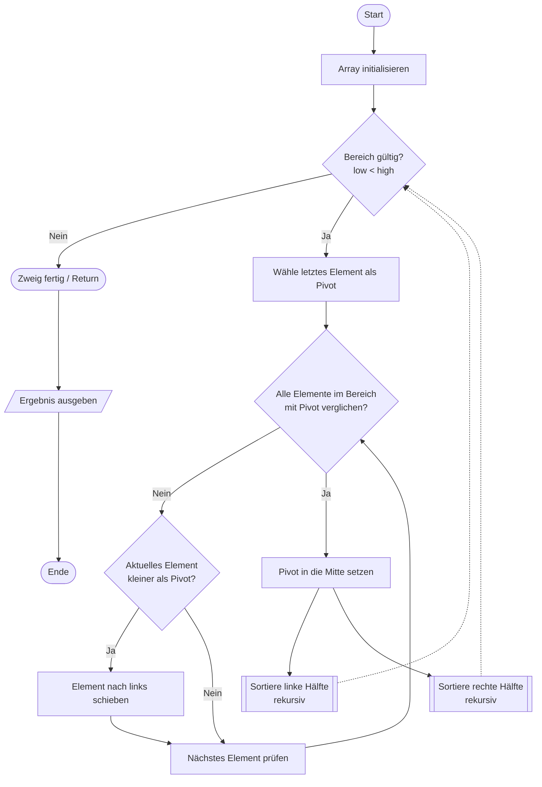

## Quick-Sort
Quicksort ist ein sehr schneller Sortieralgorithmus, der nach dem Prinzip „Teile und herrsche“ (Divide and Conquer) arbeitet.

### Grundidee
1. Wähle ein Pivot-Element
2. Teile die Liste so auf, dass
    - links vom Pivot: kleinere oder gleiche Werte
    - rechts vom Pivot: größere Werte
3. Das Pivot ist danach an der richtigen Position
4. Wende dasselbe Verfahren rekursiv auf die linke und rechte Teilliste an

### PAP des Bubble-Sorts
